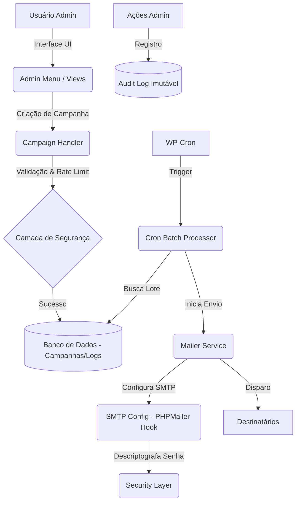

# WP Leads Mailer v3.0

O **WP Leads Mailer** é um plugin WordPress projetado para o envio de newsletters segmentadas para leads. Ele oferece um sistema robusto de processamento em lote via WP-Cron, criptografia de ponta e auditoria completa de ações.

## 🚀 Funcionalidades

- **Envio em Lote**: Processamento inteligente via Cron para evitar timeouts no servidor.
- **Criptografia Sodium**: Proteção de credenciais SMTP usando `libsodium` (com fallback para OpenSSL).
- **Auditoria Imutável**: Registro detalhado de todas as ações administrativas para conformidade e segurança.
- **Rate Limiting**: Proteção contra abusos e envios simultâneos excessivos.
- **Interface Moderna**: Dashboards dinâmicos com Select2 AJAX e barras de progresso em tempo real.
- **Compatibilidade**: Suporte total desde o PHP 7.4.33 até o PHP 8.4.

## 🏗️ Arquitetura do Sistema

## 🔒 Protocolos de Segurança

O plugin segue regras rigorosas de segurança:
1. **Verificação em 3 Camadas**: `Autenticação` -> `Capacidade (wplm_manage)` -> `Nonce único` para cada ação.
2. **Proteção de Dados**: Senhas SMTP nunca são exibidas ou logadas em texto claro. São limpas da memória imediatamente após o uso (`sodium_memzero`).
3. **Imutabilidade**: A tabela de logs de auditoria não permite `UPDATE` ou `DELETE`.
4. **Sanitização Extrema**: Todo input passa por whitelist e sanitização; todo output é escapado conforme o contexto (`esc_html`, `esc_attr`, `wp_kses`).

## 🛠️ Instalação

1. Suba a pasta `wp-leads-mailer` para o diretório `/wp-content/plugins/`.
2. Ative o plugin no painel administrativo do WordPress.
3. Configure seu servidor de e-mail em **Leads > Configurações**.
4. Comece a criar campanhas em **Leads > Novo Envio**.

## 📄 Requisitos

- **PHP**: 7.4 ou superior.
- **WordPress**: 6.0 ou superior.
- **Extensões**: Sodium ou OpenSSL (habilitadas na maioria dos servidores modernos).

---
*Desenvolvido com foco em segurança e performance por Antigravity.*