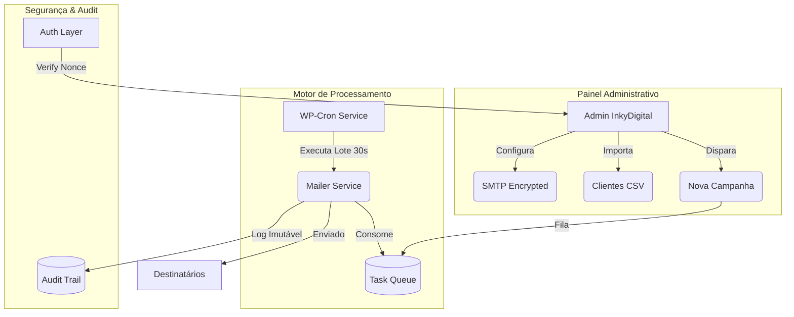

# 📧 WP Leads Mailer (v3.0)

O **WP Leads Mailer** é a solução definitiva e segura para e-mail marketing dentro do seu WordPress. Desenvolvido pela **InkyDigital**, ele combina alta performance de entrega com os mais rigorosos padrões de segurança cibernética.

---

## 🎨 Design & Funcionalidades

- **💎 Interface Premium**: Dashboards modernos com barras de progresso em tempo real e busca instantânea via Select2.
- **🚀 Entrega Turbinada**: Sistema de envio em lotes via WP-Cron, evitando sobrecarga do seu servidor SMTP.
- **📂 Gestão de Clientes**: Menu dedicado para organizar leads em grupos e importar dados em segundos.
- **🔐 Blindagem de Dados**: Criptografia baseada em Sodium para proteger suas senhas SMTP.

---

## 🏗️ Arquitetura de Alto Nível

---

## 📖 Guia de Uso Passo a Passo

### 1️⃣ Configuração SMTP
Navegue até **Leads > Configurações**. 
Insira suas credenciais (Host, Porta, Usuário e Senha). 
> [!TIP]
> Use o botão **"Testar Conexão"** para garantir que tudo está ok antes de disparar para sua lista.

### 2️⃣ Gestão & Importação de Clientes
Acesse o menu **Clientes**. Você pode adicionar manualmente ou utilizar o **Importador de CSV** nas configurações.
- O importador processa em lotes, ideal para listas de milhares de contatos.
- Identifica duplicatas automaticamente pelo e-mail.

### 3️⃣ Criando sua Primeira Campanha
Vá em **Leads > Novo Envio**.
1. **Escolha os Destinatários**: Selecionando grupos específicos ou clientes individuais.
2. **Selecione o Conteúdo**: Filtre as notícias/posts do seu site que deseja enviar.
3. **Dispare**: O sistema cuidará do resto em segundo plano.

### 4️⃣ Acompanhamento
Na aba **Campanhas**, você verá uma barra de progresso em tempo real. O plugin enviará os e-mails gradualmente para manter o "saúde" do seu IP de envio.

---

## 🔒 Segurança em Primeiro Lugar

| Recurso | Descrição |
| :--- | :--- |
| **Nonce Único** | Proteção contra ataques CSRF em cada ação. |
| **Audit Log** | Registro imutável de quem enviou o quê e quando. |
| **Sodium Crypto** | Padrão militar para armazenamento de senhas. |
| **Capability** | Apenas usuários com `wplm_manage` acessam o plugin. |

---

## 🛠️ Requisitos Técnicos

- **PHP**: 7.4 ou 8.x (Totalmente compatível com PHP 8.4)
- **Extensões**: Libsodium ou OpenSSL habilitado.

---

    
<i>Desenvolvido com excelência por</i>

    
     
    <strong>InkyDigital - Soluções Inteligentes</strong>

